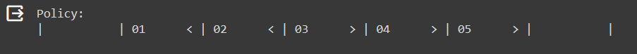
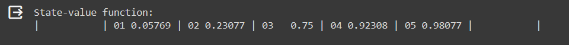
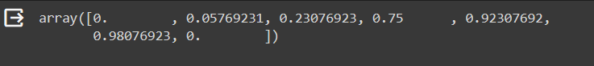

# <p align="center">POLICY EVALUATION...</p>

## AIM :

 To develop a Python program to evaluate the given policy by maximizing its cumulative reward while dealing with slippery terrain.

## PROBLEM STATEMENT : 

We are assigned with the task of creating an RL agent to solve the "Bandit Slippery Walk" problem. 

The environment consists of Seven states representing discrete positions the agent can occupy.

The agent must learn to navigate this environment while dealing with the challenge of slippery terrain.

Slippery terrain introduces stochasticity in the agent's actions, making it difficult to predict the outcomes of its actions accurately.

### States :

The environment has 7 states :

* Two Terminal States: **G**: The goal state & **H**: A hole state.

* Five Transition states / Non-terminal States including  **S**: The starting state.

### Actions :

The agent can take two actions:

* R -> Move right.
  
* L -> Move left.

### Transition Probabilities :

The transition probabilities for each action are as follows:

* **50%** chance that the agent moves in the intended direction.

* **33.33%** chance that the agent stays in its current state.
  
* **16.66%** chance that the agent moves in the opposite direction.

### Rewards :

* The agent receives a reward of +1 for reaching the goal state (G). 

* The agent receives a reward of 0 for all other states.

### Graphical Representation:


## POLICY EVALUATION FUNCTION :

### Formula :


### PROGRAM :

```python

pip install git+https://github.com/mimoralea/gym-walk#egg=gym-walk

```

```python

import warnings ; warnings.filterwarnings('ignore')

import gym, gym_walk
import numpy as np

import random
import warnings

warnings.filterwarnings('ignore', category=DeprecationWarning)
np.set_printoptions(suppress=True)
random.seed(123); np.random.seed(123)

```

### Reference https://github.com/mimoralea/gym-walk

```python

def print_policy(pi, P, action_symbols=('<', 'v', '>', '^'), n_cols=4, title='Policy:'):
    print(title)
    arrs = {k:v for k,v in enumerate(action_symbols)}
    for s in range(len(P)):
        a = pi(s)
        print("| ", end="")
        if np.all([done for action in P[s].values() for _, _, _, done in action]):
            print("".rjust(9), end=" ")
        else:
            print(str(s).zfill(2), arrs[a].rjust(6), end=" ")
        if (s + 1) % n_cols == 0: print("|")

```

```python

def print_state_value_function(V, P, n_cols=4, prec=3, title='State-value function:'):
    print(title)
    for s in range(len(P)):
        v = V[s]
        print("| ", end="")
        if np.all([done for action in P[s].values() for _, _, _, done in action]):
            print("".rjust(9), end=" ")
        else:
            print(str(s).zfill(2), '{}'.format(np.round(v, prec)).rjust(6), end=" ")
        if (s + 1) % n_cols == 0: print("|")

```

```python

def probability_success(env, pi, goal_state, n_episodes=100, max_steps=200):
    random.seed(123); np.random.seed(123) ; env.seed(123)
    results = []
    for _ in range(n_episodes):
        state, done, steps = env.reset(), False, 0
        while not done and steps < max_steps:
            state, _, done, h = env.step(pi(state))
            steps += 1
        results.append(state == goal_state)
    return np.sum(results)/len(results)

```

```python

def mean_return(env, pi, n_episodes=100, max_steps=200):
    random.seed(123); np.random.seed(123) ; env.seed(123)
    results = []
    for _ in range(n_episodes):
        state, done, steps = env.reset(), False, 0
        results.append(0.0)
        while not done and steps < max_steps:
            state, reward, done, _ = env.step(pi(state))
            results[-1] += reward
            steps += 1
    return np.mean(results)

```

## Slippery Walk Five MDP:

```python

env = gym.make('SlipperyWalkFive-v0')
P = env.env.P
init_state = env.reset()
goal_state = 6
LEFT, RIGHT = range(2)

```

```python

P

```

```python

init_state

```

```python

state, reward, done, info = env.step(RIGHT)
print("state:{0} - reward:{1} - done:{2} - info:{3}".format(state, reward, done, info))

```

```python

# First Policy
pi_1 = lambda s: {
    0:LEFT, 1:LEFT, 2:LEFT, 3:LEFT, 4:LEFT, 5:LEFT, 6:LEFT
}[s]
print_policy(pi_1, P, action_symbols=('<', '>'), n_cols=7)

```

```python

# Find the probability of success and the mean return of the first policy
print('Reaches goal {:.2f}%. Obtains an average undiscounted return of {:.4f}.'.format(
    probability_success(env, pi_1, goal_state=goal_state)*100,
    mean_return(env, pi_1)))

```

```python

 # Create your own policy

pi_2 = lambda s: {
    0:LEFT, 1:LEFT, 2:LEFT, 3:RIGHT, 4:RIGHT, 5:RIGHT, 6:RIGHT
}[s]

print_policy(pi_2, P, action_symbols=('<', '>'), n_cols=7)
```

```python

## Find the probability of success and the mean return of you your policy
print('Reaches goal {:.2f}%. Obtains an average undiscounted return of {:.4f}.'.format(
      probability_success(env, pi_2, goal_state=goal_state)*100,
      mean_return(env, pi_2)))

```

```python

# Calculate the success probability and mean return for both policies
success_prob_pi_1 = probability_success(env, pi_1, goal_state=goal_state)
mean_return_pi_1 = mean_return(env, pi_1)

success_prob_pi_2 = probability_success(env, pi_2, goal_state=goal_state)
mean_return_pi_2 = mean_return(env, pi_2)

```


## Policy Evaluation:

```python

def policy_evaluation(pi, P, gamma=1.0, theta=1e-10):
    prev_V = np.zeros(len(P), dtype=np.float64)
    # Write your code here to evaluate the given policy
    while True:
      V = np.zeros(len(P))
      for s in range(len(P)):
        for prob, next_state, reward, done in P[s][pi(s)]:
          V[s] += prob * (reward + gamma *  prev_V[next_state] * (not done))
      if np.max(np.abs(prev_V - V)) < theta:
        break
      prev_V = V.copy()
    return V

```

```python

# Code to evaluate the first policy
V1 = policy_evaluation(pi_1, P)
print_state_value_function(V1, P, n_cols=7, prec=5)

```

```python

# Code to evaluate the second policy
# Write your code here
V2 = policy_evaluation(pi_2, P)
print_state_value_function(V2, P, n_cols=7, prec=5)

```

```python

# Comparing the two policies

# Compare the two policies based on the value function using the above equation and find the best policy

V1

print_state_value_function(V1, P, n_cols=7, prec=5)

V2

print_state_value_function(V2, P, n_cols=7, prec=5)

V1>=V2

if(np.sum(V1>=V2)==7):
  print("The first policy has the better policy")
elif(np.sum(V2>=V1)==7):
  print("The second policy has the better policy")
else:
  print("Both policies have their merits.")

```

## OUTPUT :

#### Policy-1 : 


#### Policy-1 State-value function :


#### Policy-1 evaluation : 


#### Policy-2 :



#### Policy-2 State-value function :


#### Policy-2 evaluation :



#### Comparison between 1st and 2nd policy : 


#### Conclusion on 1st and 2nd policy : 


## RESULT :

Thus, the Given Policy has been Evaluated and Optimal Policy has been Computed using Python Programming and execcuted successfully.

